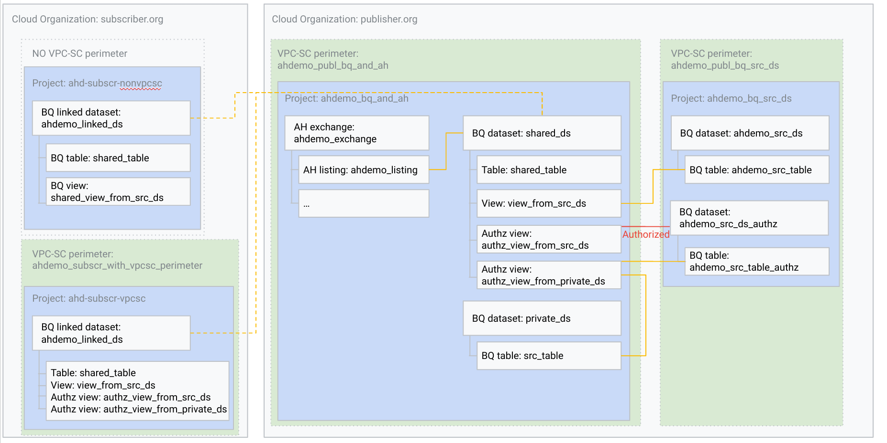
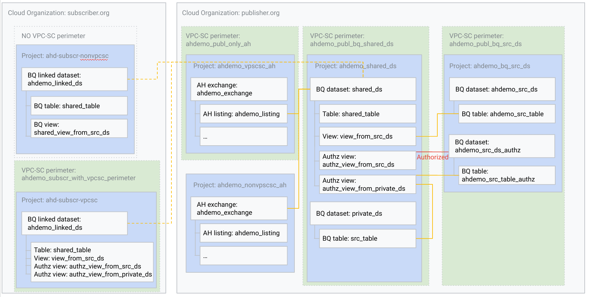

# Analytics Hub / BigQuery / VPC-Service Controls end-to-end solution accelerator

This repository hosts automation that creates an end-to-end deployment of Analytics Hub / BigQuery data publishers and subscribers with enterprise grade security.

<!-- TOC start (generated with https://github.com/derlin/bitdowntoc) -->

- [Architectures](#architectures)
- [Bootstrap / prerequisites](#bootstrap-prerequisites)
   * [Prerequisites](#prerequisites)
   * [Step 0 - Create seed (setup-0-google-cloud-seed.sh)](#step-0-create-seed-setup-0-google-cloud-seedsh)
   * [Step 1 - Initialize seed projects and create publisher / subscriber projects](#step-1-initialize-seed-projects-and-create-publisher-subscriber-projects)
   * [Step 2 - Test credentials and impersonation](#step-2-test-credentials-and-impersonation)
   * [Step 3 - bootstrap publisher and subscriber seed projects](#step-3-bootstrap-publisher-and-subscriber-seed-projects)
   * [Step 4 - Publisher - Create VPC-SC resources: (singleton) Global Access Policy, Access Levels, Perimeters](#step-4-publisher-create-vpc-sc-resources-singleton-global-access-policy-access-levels-perimeters)
   * [Step 5 - Publisher - Create BigQuery, Analytics Hub resources: datasets, views, exchanges, listings](#step-5-publisher-create-bigquery-analytics-hub-resources-datasets-views-exchanges-listings)
   * [Step 6 - Publisher - Load sample data](#step-6-publisher-load-sample-data)
   * [Stage 7 - Subscriber project, subscribe API call scripts](#stage-7-subscriber-project-subscribe-api-call-scripts)
- [Testing](#testing)
   * [Helper scripts](#helper-scripts)
- [Cleanup](#cleanup)
   * [Delete the resources provisioned by terraform by going through the terrform steps in reverse order](#delete-the-resources-provisioned-by-terraform-by-going-through-the-terrform-steps-in-reverse-order)
   * [Delete the resources provisioned by the bootstrap `s00-setup-google-cloud-seed.sh` script](#delete-the-resources-provisioned-by-the-bootstrap-s00-setup-google-cloud-seedsh-script)
- [Troubleshooting](#troubleshooting)
   * [`Error creating AccessPolicy: googleapi: Error 409: Policy already exists with parent organizations/749200211693`](#error-creating-accesspolicy-googleapi-error-409-policy-already-exists-with-parent-organizations749200211693)
   * [`googleapi: Error 400: Service account bq-888634078875@bigquery-encryption.iam.gserviceaccount.com does not exist.`](#googleapi-error-400-service-account-bq-888634078875bigquery-encryptioniamgserviceaccountcom-does-not-exist)
- [Versioning](#versioning)
- [Code of Conduct](#code-of-conduct)
- [Contributing](#contributing)
- [License](#license)

<!-- TOC end -->

<!-- TOC --><a name="architectures"></a>
## Architectures

The following projects are used across the different architectures. The VPC SC perimeters have corresponding names.

Projects

| PROJECT_ID | ORG | VPC-SC | DESCRIPTION |
|---|---|---|---|
| ahd-subscr-0419c0-seed | Subscriber | NO | Seed project hosting terraform state bucket and service account |
| ahd-subscr-0419c0-nonvpcsc | Subscriber | NO | Subscriber project without VPC-SC - hosts the linked dataset |
| ahd-subscr-0419c0-vpcsc | Subscriber | YES | Subscriber project with VPC-SC - hosts the linked dataset |
| ahd-publ-0419c0-seed | Publisher | NO | Seed project hosting terraform state bucket and service account |
| ahd-publ-0419c0-vpcsc-ah | Publisher | YES | Publisher project in its own VPC-SC perimeter - hosts Analytics Hub Exchanges and Listings |
| ahd-publ-0419c0-novpcsc-ah | Publisher | NO | Publisher project outside VPC-SC perimeter - hosts Analytics Hub Exchanges and Listings |
| ahd-publ-0419c0-vpcsc-bqah | Publisher | YES | Publisher project in its own VPC-SC perimeter - hosts both Analytics Hub Exchanges and Listings and the BigQuery shared dataset |
| ahd-publ-0419c0-bq-shared-ds | Publisher | YES | Publisher project in its own VPC-SC perimeter - hosts the shared dataset |
| ahd-publ-0419c0-bq-src-ds | Publisher | YES | Publisher project in its own VPC-SC perimeter - hosts the source dataset. The source dataset is not shared directly, only shared through views / authorized views |





<!-- TOC --><a name="bootstrap-prerequisites"></a>
## Bootstrap / prerequisites

For the sake of simplicity (and time) and making it easier to see the whole configuration at once, currently terraform is using symbolic links to share certain configuration in this repository. This may change in the future to adhere to best practices .. which is to avoid using symlinks as much as possible.

If symbolic links don't work, copy the required files into each stage:

```
./s0-publ-create-projects-bootstrap/variables.tf -> ../common/variables.tf
./s0-publ-create-projects-bootstrap/terraform.auto.tfvars -> ../generated/terraform.auto.tfvars
./s0-subscr-create-projects-bootstrap/variables.tf -> ../common/variables.tf
./s0-subscr-create-projects-bootstrap/terraform.auto.tfvars -> ../generated/terraform.auto.tfvars
./s1-publ-bootstrap/variables.tf -> ../common/variables.tf
./s1-publ-bootstrap/terraform.auto.tfvars -> ../generated/terraform.auto.tfvars
./s1-subscr-bootstrap/variables.tf -> ../common/variables.tf
./s1-subscr-bootstrap/terraform.auto.tfvars -> ../generated/terraform.auto.tfvars
./s2-publ-vpc-sc/terraform.publ_project_numbers.auto.tfvars -> ../generated/terraform.publ_project_numbers.auto.tfvars
./s2-publ-vpc-sc/variables_project_numbers.tf -> ../common/variables_project_numbers.tf
./s2-publ-vpc-sc/terraform.subscr_project_numbers.auto.tfvars -> ../generated/terraform.subscr_project_numbers.auto.tfvars
./s2-publ-vpc-sc/variables.tf -> ../common/variables.tf
./s2-publ-vpc-sc/terraform.auto.tfvars -> ../generated/terraform.auto.tfvars
./s3-publ-bigquery-analyticshub/terraform.publ_project_numbers.auto.tfvars -> ../generated/terraform.publ_project_numbers.auto.tfvars
./s3-publ-bigquery-analyticshub/variables_project_numbers.tf -> ../common/variables_project_numbers.tf
./s3-publ-bigquery-analyticshub/terraform.subscr_project_numbers.auto.tfvars -> ../generated/terraform.subscr_project_numbers.auto.tfvars
./s3-publ-bigquery-analyticshub/variables.tf -> ../common/variables.tf
./s3-publ-bigquery-analyticshub/terraform.auto.tfvars -> ../generated/terraform.auto.tfvars
./s4-subscr-subscriber-projects/terraform.publ_project_numbers.auto.tfvars -> ../generated/terraform.publ_project_numbers.auto.tfvars
./s4-subscr-subscriber-projects/variables_project_numbers.tf -> ../common/variables_project_numbers.tf
./s4-subscr-subscriber-projects/terraform.subscr_project_numbers.auto.tfvars -> ../generated/terraform.subscr_project_numbers.auto.tfvars
./s4-subscr-subscriber-projects/variables.tf -> ../common/variables.tf
./s4-subscr-subscriber-projects/terraform.auto.tfvars -> ../generated/terraform.auto.tfvars
```

<!-- TOC --><a name="prerequisites"></a>
### Prerequisites

- (Ideally) two Google Cloud organizations with Cloud Organization Admin rights (which can grant additional roles needed)
  - publisher-org-domain.org
  - subscriber-org-domain.org

- Subscriber user accounts (existing Google Accounts):
  - Administrator (can manage the projects)
  - Subscriber (can see the listing, and subscribe)
  - Subscription Viewer (can see the listing, and click request access)
  - BigQuery reader (can use BigQuery, but can't see the listing / subscribe)

- Publisher user accounts (existing Google Accounts):
  - Administrator (can manage the projects)

- Billing account with role `Billing Account User`

- IAM roles
  - Organization: Project Creator, Organization Admin

<!-- TOC --><a name="step-0-create-seed-setup-0-google-cloud-seedsh"></a>
### Step 0 - Create seed (setup-0-google-cloud-seed.sh)

**This stage will use your APPLICATION_DEFAULT_CREDENTIALS.**

The current gcloud user (shown in `gcloud auth list`) needs the following roles:
* Project Creator (on the orgs)
* Organization Administrator (on the orgs)
* Billing User (on the billing account)

This stage will 
* create the seed projects
* create the terraform state buckets in them
* generate the terraform.auto.tfvars file based on the environment from `setup.env`
* generate the terraform backend configurations for each stage

Usage:

1. Copy `setup.env.exampe` -> `setup.env`
1. Edit `setup.env`
1. Run `s00-setup-google-cloud-seed.sh`
1. Run `s01-setup-generate-tf-configs.sh`

In `setup.env`, modify at least the following lines:

```
# 5 character long suffix - because project ids are globally unique and non-reusable, this is used between subseqent create-destroy operations
# It's also added to all other resources created: Service Account, Access Level, VPC SC Perimeter, BigQuery Dataset/Table/View, Analytics Hub Listing/Exchange
export SUFFIX=
# Publisher org's numeric id
export PUBLISHER_ORG_ID=
# Publisher org's name
export PUBLISHER_ORG_NAME=
# Subscriber org's numeric id
export SUBSCRIBER_ORG_ID=
# Subscriber org's numeric id
export SUBSCRIBER_ORG_NAME=
# Billing Account to link to projects created during stage 0 bootstrap
export BILLING_ACCOUNT_ID=
# Google User Account that will be able to impersonate the service accounts (usually the one active in `gcloud auth list)`
export GCLOUD_USER="gclouduser@nonexisting-domain.com"
# Google User Account that will be granted broad privileges on the target publisher org
export PUBL_ADMIN_USER="ahdemo-publ-admin@nonexisting-domain.com"
# Google User Account that will be granted broad privileges on the target subscriber org
export SUBSCR_ADMIN_USER="ahdemo-subscr-admin@nonexisting-domain.com"
# Google User Account that will be granted subscriber privileges
export SUBSCRIBER_USER="ahdemo-subscriber@nonexisting-domain.com"
# Google User Account that will be granted subscription viewer privileges
export SUBSCRIPTION_VIEWER_USER="ahdemo-subscription-viewer@nonexisting-domain.com"
# Google User Account that will be granted bigquery viewer roles in the subscriber projects
export BQREADER_USER="ahdemo-bq-reader@nonexisting-domain.com"
# Contact for requesting access to the listing (e-mail address or URL). The request access button will redirect here.
export REQUEST_ACCESS_EMAIL_OR_URL="contact-sales@nonexisting-domain.com"
```

Run `./s00-setup-google-cloud-seed.sh`, example output:

```
Checking seed projects ahd-publ-0419c0-seed ahd-subscr-0419c0-seed ... 
Checking project ahd-publ-0419c0-seed ... Status: FAILED
Creating project ahd-publ-0419c0-seed ... Status: OK
Linking billing account ... Status: OK
Checking project ahd-subscr-0419c0-seed ... Status: FAILED
Creating project ahd-subscr-0419c0-seed ... Status: OK
Linking billing account ... Status: OK
Enabling cloudresourcemanager.googleapis.com on seed project ahd-publ-0419c0-seed ... 
Enabling cloudresourcemanager.googleapis.com on seed project ahd-subscr-0419c0-seed ... 
Enabling accesscontextmanager.googleapis.com on seed project ahd-publ-0419c0-seed ... 
Enabling accesscontextmanager.googleapis.com on seed project ahd-subscr-0419c0-seed ... 
Enabling iam.googleapis.com on seed project ahd-publ-0419c0-seed ... 
Enabling iam.googleapis.com on seed project ahd-subscr-0419c0-seed ... 
Enabling cloudbilling.googleapis.com on seed project ahd-publ-0419c0-seed ... 
Enabling cloudbilling.googleapis.com on seed project ahd-subscr-0419c0-seed ... 
Checking terraform state bucket gs://tf-state-ahdemo-publ-0419c0 ... Status: CREATED
Checking terraform state bucket gs://tf-state-ahdemo-subscr-0419c0 ... Status: CREATED
```

Run `./s01-setup-generate-tf-configs.sh`, example output:

```
Generating the terraform configuration based on templates ... 
./templates/terraform.auto.tfvars.tpl > ./generated/terraform.auto.tfvars
./s0-publ-create-projects-bootstrap/backend.tf.tpl > ./s0-publ-create-projects-bootstrap/backend.tf
./s0-subscr-create-projects-bootstrap/backend.tf.tpl > ./s0-subscr-create-projects-bootstrap/backend.tf
./s1-publ-bootstrap/backend.tf.tpl > ./s1-publ-bootstrap/backend.tf
./s1-subscr-bootstrap/backend.tf.tpl > ./s1-subscr-bootstrap/backend.tf
./s2-publ-vpc-sc/backend.tf.tpl > ./s2-publ-vpc-sc/backend.tf
./s3-publ-bigquery-analyticshub/backend.tf.tpl > ./s3-publ-bigquery-analyticshub/backend.tf
./s4-subscr-subscriber-projects/backend.tf.tpl > ./s4-subscr-subscriber-projects/backend.tf
```

Review `generated/terraform.auto.tfvars`

<!-- TOC --><a name="step-1-initialize-seed-projects-and-create-publisher-subscriber-projects"></a>
### Step 1 - Initialize seed projects and create publisher / subscriber projects

This stage will:

* initialize the subscriber and publisher seed projects
* create the subscriber and publisher projects
* create the terraform service accounts and grant impersonation
* create the subscriber service account and grant impersonation
* grant broad org wide privileges to the publisher / subscriber terraform service accounts that will be used in the subsequent stages in order to achieve full org separation

**This stage will use your APPLICATION_DEFAULT_CREDENTIALS. The current gcloud user (shown in `gcloud auth list`) needs to have Project Creator and Organization Administrator roles.**

Usage:

```
user@workstation:~$ cd s0-publ-create-projects-bootstrap
user@workstation:~$ unset GOOGLE_BACKEND_IMPERSONATE_SERVICE_ACCOUNT
user@workstation:~$ unset GOOGLE_IMPERSONATE_SERVICE_ACCOUNT
user@workstation:~$ tf init
user@workstation:~$ tf apply
```

```
user@workstation:~$ cd s0-subscr-create-projects-bootstrap
user@workstation:~$ unset GOOGLE_BACKEND_IMPERSONATE_SERVICE_ACCOUNT
user@workstation:~$ unset GOOGLE_IMPERSONATE_SERVICE_ACCOUNT
user@workstation:~$ tf init
user@workstation:~$ tf apply
```


<!-- TOC --><a name="step-2-test-credentials-and-impersonation"></a>
### Step 2 - Test credentials and impersonation

Test impersonation

```
user@workstation:~$ export GOOGLE_BACKEND_IMPERSONATE_SERVICE_ACCOUNT=terraform-0419c0@ahd-publ-0419c0-seed.iam.gserviceaccount.com
user@workstation:~$ export GOOGLE_IMPERSONATE_SERVICE_ACCOUNT=terraform-0419c0@ahd-publ-0419c0-seed.iam.gserviceaccount.com
user@workstation:~$ gcloud auth print-access-token --impersonate-service-account $GOOGLE_IMPERSONATE_SERVICE_ACCOUNT >/dev/null 2>&1 && echo "Service Account impersonation working"
```

```
user@workstation:~$ export GOOGLE_BACKEND_IMPERSONATE_SERVICE_ACCOUNT=terraform-0419c0@ahd-subscr-0419c0-seed.iam.gserviceaccount.com
user@workstation:~$ export GOOGLE_IMPERSONATE_SERVICE_ACCOUNT=terraform-0419c0@ahd-subscr-0419c0-seed.iam.gserviceaccount.com
user@workstation:~$ gcloud auth print-access-token --impersonate-service-account $GOOGLE_IMPERSONATE_SERVICE_ACCOUNT >/dev/null 2>&1 && echo "Service Account impersonation working"
```

<!-- TOC --><a name="step-3-bootstrap-publisher-and-subscriber-seed-projects"></a>
### Step 3 - bootstrap publisher and subscriber seed projects

This stage will:

- Initialize networking
  - VPC
  - Firewall
  - Private Google Access (PGA)
  - Private Service Access / Networking (PSA)
  - Cloud NAT
  - Cloud DNS for PGA
- Create a jumphost
- Disable Domain Restricted Sharing on the projects
- Write project numbers required for the VPC SC rules into
  - `generated/terraform.publ_project_numbers.auto.tfvars`
  - `generated/terraform.subscr_project_numbers.auto.tfvars`

Usage:

```
user@workstation:~$ cd s1-publ-bootstrap
user@workstation:~$ export GOOGLE_BACKEND_IMPERSONATE_SERVICE_ACCOUNT="terraform-0419c0@ahd-publ-0419c0-seed.iam.gserviceaccount.com"
user@workstation:~$ export GOOGLE_IMPERSONATE_SERVICE_ACCOUNT="terraform-0419c0@ahd-publ-0419c0-seed.iam.gserviceaccount.com"
user@workstation:~$ tf init
user@workstation:~$ tf apply
```

```
user@workstation:~$ cd s1-subscr-bootstrap
user@workstation:~$ export GOOGLE_BACKEND_IMPERSONATE_SERVICE_ACCOUNT="terraform-0419c0@ahd-subscr-0419c0-seed.iam.gserviceaccount.com"
user@workstation:~$ export GOOGLE_IMPERSONATE_SERVICE_ACCOUNT="terraform-0419c0@ahd-subscr-0419c0-seed.iam.gserviceaccount.com"
user@workstation:~$ tf init
user@workstation:~$ tf apply
```

<!-- TOC --><a name="step-4-publisher-create-vpc-sc-resources-singleton-global-access-policy-access-levels-perimeters"></a>
### Step 4 - Publisher - Create VPC-SC resources: (singleton) Global Access Policy, Access Levels, Perimeters

Usage:

```
user@workstation:~$ cd s2-publ-vpc-sc
user@workstation:~$ export GOOGLE_BACKEND_IMPERSONATE_SERVICE_ACCOUNT="terraform-0419c0@ahd-publ-0419c0-seed.iam.gserviceaccount.com"
user@workstation:~$ export GOOGLE_IMPERSONATE_SERVICE_ACCOUNT="terraform-0419c0@ahd-publ-0419c0-seed.iam.gserviceaccount.com"
user@workstation:~$ tf init
user@workstation:~$ tf apply
```


<!-- TOC --><a name="step-5-publisher-create-bigquery-analytics-hub-resources-datasets-views-exchanges-listings"></a>
### Step 5 - Publisher - Create BigQuery, Analytics Hub resources: datasets, views, exchanges, listings

Prerequisite trigger creation of BQ encryption SA:

```
user@workstation:~$ bq show --encryption_service_account --project_id=ahd-publ-0419c0-vpcsc-bqah
user@workstation:~$ bq show --encryption_service_account --project_id=ahd-publ-0419c0-bq-shared-ds
user@workstation:~$ bq show --encryption_service_account --project_id=ahd-publ-0419c0-bq-src-ds
```

Usage:

```
user@workstation:~$ cd s3-publ-bigquery-analyticshub
user@workstation:~$ export GOOGLE_BACKEND_IMPERSONATE_SERVICE_ACCOUNT="terraform-0419c0@ahd-publ-0419c0-seed.iam.gserviceaccount.com"
user@workstation:~$ export GOOGLE_IMPERSONATE_SERVICE_ACCOUNT="terraform-0419c0@ahd-publ-0419c0-seed.iam.gserviceaccount.com"
user@workstation:~$ tf init
user@workstation:~$ tf apply
```

Obtain the output of `tf apply`:

```
Outputs:

bq_load_command_shared_ds_private_dataset = "bq --project_id ahd-publ-0422c0-bq-shared-ds load --source_format NEWLINE_DELIMITED_JSON ahdemo_0422c0_private_ds.ahdemo_0422c0_src_table gs://tf-state-ahdemo-publ-0422c0/bigquery/data_src.jsonl"
bq_load_command_shared_ds_shared_dataset = "bq --project_id ahd-publ-0422c0-bq-shared-ds load --source_format NEWLINE_DELIMITED_JSON ahdemo_0422c0_shared_ds.ahdemo_0422c0_shared_table gs://tf-state-ahdemo-publ-0422c0/bigquery/data.jsonl"
bq_load_command_src_ds_src_dataset = "bq --project_id ahd-publ-0422c0-bq-src-ds load --source_format NEWLINE_DELIMITED_JSON ahdemo_0422c0_src_ds.ahdemo_0422c0_src_table gs://tf-state-ahdemo-publ-0422c0/bigquery/data_src.jsonl"
bq_load_command_src_ds_src_dataset_authz = "bq --project_id ahd-publ-0422c0-bq-src-ds load --source_format NEWLINE_DELIMITED_JSON ahdemo_0422c0_src_ds_authz.ahdemo_0422c0_src_table_authz gs://tf-state-ahdemo-publ-0422c0/bigquery/data_src.jsonl"
```

<!-- TOC --><a name="step-6-publisher-load-sample-data"></a>
### Step 6 - Publisher - Load sample data

Usage: set service account impersonation to the publisher's Terraform Service Account and run the bq_load commands from the previous step.

```
user@workstation:~$ gcloud config set auth/impersonate_service_account "terraform-0419c0@ahd-publ-0419c0-seed.iam.gserviceaccount.com"
user@workstation:~$ bq --project_id ahd-publ-0422c0-bq-shared-ds load --source_format NEWLINE_DELIMITED_JSON ahdemo_0422c0_private_ds.ahdemo_0422c0_src_table gs://tf-state-ahdemo-publ-0422c0/bigquery/data_src.jsonl
WARNING: This command is using service account impersonation. All API calls will be executed as [terraform-0422c0@ahd-publ-0422c0-seed.iam.gserviceaccount.com].
Waiting on bqjob_r3f763c55181ac535_0000018f0a962f01_1 ... (3s) Current status: DONE   
user@workstation:~$ bq --project_id ahd-publ-0422c0-bq-shared-ds load --source_format NEWLINE_DELIMITED_JSON ahdemo_0422c0_shared_ds.ahdemo_0422c0_shared_table gs://tf-state-ahdemo-publ-0422c0/bigquery/data.jsonl
WARNING: This command is using service account impersonation. All API calls will be executed as [terraform-0422c0@ahd-publ-0422c0-seed.iam.gserviceaccount.com].
Waiting on bqjob_r3f763c55181ac535_0000018f0a962f01_1 ... (3s) Current status: DONE   
user@workstation:~$ bq --project_id ahd-publ-0422c0-bq-src-ds load --source_format NEWLINE_DELIMITED_JSON ahdemo_0422c0_src_ds.ahdemo_0422c0_src_table gs://tf-state-ahdemo-publ-0422c0/bigquery/data_src.jsonl
WARNING: This command is using service account impersonation. All API calls will be executed as [terraform-0422c0@ahd-publ-0422c0-seed.iam.gserviceaccount.com].
Waiting on bqjob_r3f763c55181ac535_0000018f0a962f01_1 ... (3s) Current status: DONE   
user@workstation:~$ bq --project_id ahd-publ-0422c0-bq-src-ds load --source_format NEWLINE_DELIMITED_JSON ahdemo_0422c0_src_ds_authz.ahdemo_0422c0_src_table_authz gs://tf-state-ahdemo-publ-0422c0/bigquery/data_src.jsonl
WARNING: This command is using service account impersonation. All API calls will be executed as [terraform-0422c0@ahd-publ-0422c0-seed.iam.gserviceaccount.com].
Waiting on bqjob_r3f763c55181ac535_0000018f0a962f01_1 ... (3s) Current status: DONE   
user@workstation:~$ gcloud config unset auth/impersonate_service_account
```

<!-- TOC --><a name="stage-7-subscriber-project-subscribe-api-call-scripts"></a>
### Stage 7 - Subscriber project, subscribe API call scripts

Usage:

```
user@workstation:~$ cd s4-subscr-subscriber-projects
user@workstation:~$ export GOOGLE_BACKEND_IMPERSONATE_SERVICE_ACCOUNT="terraform-0419c0@ahd-subscr-0419c0-seed.iam.gserviceaccount.com"
user@workstation:~$ export GOOGLE_IMPERSONATE_SERVICE_ACCOUNT="terraform-0419c0@ahd-subscr-0419c0-seed.iam.gserviceaccount.com"
user@workstation:~$ tf init
user@workstation:~$ tf apply
```

<!-- TOC --><a name="testing"></a>
## Testing

The following scripts are generated to help with testing subscription:

- `generated/subscribe_priv_ah_dedicated.sh`
- `generated/subscribe_priv_bqah.sh`
- `generated/subscribe_priv_nonvpcsc_ah_dedicated.sh`
- `generated/subscribe_publ_ah_dedicated.sh`
- `generated/subscribe_publ_bqah.sh`
- `generated/subscribe_publ_nonvpcsc_ah_dedicated.sh`

There are API calls for subscribing to the listings and also for deleting the linked datasets that are created as a result of a successful subscription.

<!-- TOC --><a name="helper-scripts"></a>
### Helper scripts

There are some helper scripts provided to help with testing:

- `subscr_delete_datasets.sh`

   Loops through all datasets within the subscriber projects and deletes them.

- `subscr_list_datasets.sh`

   Loops through all datasets within the subscriber projects and displays them.

- `subscr_list_subscriptions.sh`

   Loops through all subscriptions within the subscriber projects and displays them.

- `subscr_unsubscribe_all_subscriptions.sh`

   Loops through all subscriptions within the subscriber projects and unsubscribes all of them. This also removes the linked datasets.

- `publ_list_exchanges_subscriptions.sh`

   Loops through all exchanges / listings / subscriptions within the publisher projects and displays them.

- `test_queries.sh`

   Executes `SELECT *` queries on all tables/views in all linked datasets in the subscriber projects.

<!-- TOC --><a name="cleanup"></a>
## Cleanup

<!-- TOC --><a name="delete-the-resources-provisioned-by-terraform-by-going-through-the-terrform-steps-in-reverse-order"></a>
### Delete the resources provisioned by terraform by going through the terrform steps in reverse order

```
user@workstation:~$ cd s4-subscr-subscriber-projects
user@workstation:~$ export GOOGLE_BACKEND_IMPERSONATE_SERVICE_ACCOUNT="terraform-0419c0@ahd-subscr-0419c0-seed.iam.gserviceaccount.com"
user@workstation:~$ export GOOGLE_IMPERSONATE_SERVICE_ACCOUNT="terraform-0419c0@ahd-subscr-0419c0-seed.iam.gserviceaccount.com"
user@workstation:~$ tf destroy
```

```
user@workstation:~$ cd s3-publ-bigquery-analyticshub
user@workstation:~$ export GOOGLE_BACKEND_IMPERSONATE_SERVICE_ACCOUNT="terraform-0419c0@ahd-publ-0419c0-seed.iam.gserviceaccount.com"
user@workstation:~$ export GOOGLE_IMPERSONATE_SERVICE_ACCOUNT="terraform-0419c0@ahd-publ-0419c0-seed.iam.gserviceaccount.com"
user@workstation:~$ tf destroy
```

```
user@workstation:~$ cd s2-publ-vpc-sc
user@workstation:~$ export GOOGLE_BACKEND_IMPERSONATE_SERVICE_ACCOUNT="terraform-0419c0@ahd-publ-0419c0-seed.iam.gserviceaccount.com"
user@workstation:~$ export GOOGLE_IMPERSONATE_SERVICE_ACCOUNT="terraform-0419c0@ahd-publ-0419c0-seed.iam.gserviceaccount.com"
user@workstation:~$ tf destroy
```

```
user@workstation:~$ cd s1-publ-bootstrap
user@workstation:~$ export GOOGLE_BACKEND_IMPERSONATE_SERVICE_ACCOUNT="terraform-0419c0@ahd-publ-0419c0-seed.iam.gserviceaccount.com"
user@workstation:~$ export GOOGLE_IMPERSONATE_SERVICE_ACCOUNT="terraform-0419c0@ahd-publ-0419c0-seed.iam.gserviceaccount.com"
user@workstation:~$ tf destroy
```

```
user@workstation:~$ cd s1-subscr-bootstrap
user@workstation:~$ export GOOGLE_BACKEND_IMPERSONATE_SERVICE_ACCOUNT="terraform-0419c0@ahd-subscr-0419c0-seed.iam.gserviceaccount.com"
user@workstation:~$ export GOOGLE_IMPERSONATE_SERVICE_ACCOUNT="terraform-0419c0@ahd-subscr-0419c0-seed.iam.gserviceaccount.com"
user@workstation:~$ tf destroy
```

```
user@workstation:~$ cd s0-publ-create-projects-bootstrap
user@workstation:~$ unset GOOGLE_BACKEND_IMPERSONATE_SERVICE_ACCOUNT
user@workstation:~$ unset GOOGLE_IMPERSONATE_SERVICE_ACCOUNT
user@workstation:~$ tf destroy
```

```
user@workstation:~$ cd s0-subscr-create-projects-bootstrap
user@workstation:~$ unset GOOGLE_BACKEND_IMPERSONATE_SERVICE_ACCOUNT
user@workstation:~$ unset GOOGLE_IMPERSONATE_SERVICE_ACCOUNT
user@workstation:~$ tf destroy
```

<!-- TOC --><a name="delete-the-resources-provisioned-by-the-bootstrap-s00-setup-google-cloud-seedsh-script"></a>
### Delete the resources provisioned by the bootstrap `s00-setup-google-cloud-seed.sh` script

```
user@workstation:~/git/ahdemo$ ./s99-cleanup.sh
Deleting terraform state bucket gs://tf-state-ahdemo-publ-0419c0 ... Status: OK
Deleting terraform state bucket gs://tf-state-ahdemo-subscr-0419c0 ... Status: OK
Deleting the seed projects
Deleting project ahd-publ-0419c0-seed ... Status: OK
Deleting project ahd-subscr-0419c0-seed ... Status: OK
Deleting the generated terraform configuration ... 
- ./generated/terraform.auto.tfvars
- ./s0-publ-create-projects-bootstrap/backend.tf
- ./s0-subscr-create-projects-bootstrap/backend.tf
- ./s1-publ-bootstrap/backend.tf
- ./s1-subscr-bootstrap/backend.tf
- ./s2-publ-vpc-sc/backend.tf
- ./s3-publ-bigquery-analyticshub/backend.tf
- ./s4-subscr-subscriber-projects/backend.tf
Removing terraform local files ...
- s0-publ-create-projects-bootstrap/{.terraform/,.terraform.lock.hcl}
- s0-subscr-create-projects-bootstrap/{.terraform/,.terraform.lock.hcl}
- s1-publ-bootstrap/{.terraform/,.terraform.lock.hcl}
- s1-subscr-bootstrap/{.terraform/,.terraform.lock.hcl}
- s2-publ-vpc-sc/{.terraform/,.terraform.lock.hcl}
- s3-publ-bigquery-analyticshub/{.terraform/,.terraform.lock.hcl}
- s4-subscr-subscriber-projects/{.terraform/,.terraform.lock.hcl}
```

<!-- TOC --><a name="troubleshooting"></a>
## Troubleshooting

<!-- TOC --><a name="error-creating-accesspolicy-googleapi-error-409-policy-already-exists-with-parent-organizations749200211693"></a>
### `Error creating AccessPolicy: googleapi: Error 409: Policy already exists with parent organizations/749200211693`

If you are using an already existing organization, you may need to import the global access policy if it already exists. 
The global access policy is a singleton object, only one global access policy is allowed to exist.

Error message:

```
╷
│ Error: Error creating AccessPolicy: googleapi: Error 409: Policy already exists with parent organizations/749200211693
│ 
│   with module.access_context_manager_policy.google_access_context_manager_access_policy.access_policy,
│   on .terraform/modules/access_context_manager_policy/main.tf line 17, in resource "google_access_context_manager_access_policy" "access_policy":
│   17: resource "google_access_context_manager_access_policy" "access_policy" {
│ 
╵
```

Solution:

```
$ gcloud access-context-manager policies list --organization 749200211693 --impersonate-service-account $GOOGLE_IMPERSONATE_SERVICE_ACCOUNT 
WARNING: This command is using service account impersonation. All API calls will be executed as [terraform@ahdemo-240322-seed.iam.gserviceaccount.com].
WARNING: This command is using service account impersonation. All API calls will be executed as [terraform@ahdemo-240322-seed.iam.gserviceaccount.com].
NAME          ORGANIZATION  SCOPES  TITLE          ETAG
588164632170  749200211693          ahdemo-policy  2b9a132235b32dc8

$ tf import module.access_context_manager_policy.google_access_context_manager_access_policy.access_policy 588164632170
```

<!-- TOC --><a name="googleapi-error-400-service-account-bq-888634078875bigquery-encryptioniamgserviceaccountcom-does-not-exist"></a>
### `googleapi: Error 400: Service account bq-888634078875@bigquery-encryption.iam.gserviceaccount.com does not exist.`

The service account used for accessing the CloudKMS keys by BigQuery may not be provisioned.

Error message:

```
│ Error: Request `Create IAM Members roles/cloudkms.cryptoKeyEncrypterDecrypter serviceAccount:bq-888634078875@bigquery-encryption.iam.gserviceaccount.com for project "ahd-publ-0422c0-bq-src-ds"` returned error: Batch request and retried single request "Create IAM Members roles/cloudkms.cryptoKeyEncrypterDecrypter serviceAccount:bq-888634078875@bigquery-encryption.iam.gserviceaccount.com for project \"ahd-publ-0422c0-bq-src-ds\"" both failed. Final error: Error applying IAM policy for project "ahd-publ-0422c0-bq-src-ds": Error setting IAM policy for project "ahd-publ-0422c0-bq-src-ds": googleapi: Error 400: Service account bq-888634078875@bigquery-encryption.iam.gserviceaccount.com does not exist.
│ Details:
│ [
│   {
│     "@type": "type.googleapis.com/google.rpc.DebugInfo",
│     "detail": "Service account bq-888634078875@bigquery-encryption.iam.gserviceaccount.com does not exist."
│   }
│ ]
│ , badRequest
│ 
│   with google_project_iam_member.bq_src_ds_kms_service_account_access,
│   on bigquery_bq_src_ds.tf line 26, in resource "google_project_iam_member" "bq_src_ds_kms_service_account_access":
│   26: resource "google_project_iam_member" "bq_src_ds_kms_service_account_access" {
│ 
╵
```

Solution:

```
user@workstation:~$ bq show --encryption_service_account --project_id=ahd-publ-0422c0-vpcsc-bqah
user@workstation:~$ bq show --encryption_service_account --project_id=ahd-publ-0422c0-bq-shared-ds
user@workstation:~$ bq show --encryption_service_account --project_id=ahd-publ-0422c0-bq-src-ds
```

<!-- TOC --><a name="versioning"></a>
## Versioning

Initial Version March 2024

<!-- TOC --><a name="code-of-conduct"></a>
## Code of Conduct

[View](../docs/code-of-conduct.md)

<!-- TOC --><a name="contributing"></a>
## Contributing

[View](../docs/contributing.md)

<!-- TOC --><a name="license"></a>
## License

[View](../LICENSE)

## Disclaimer

This project is not an official Google project. It is not supported by
Google and Google specifically disclaims all warranties as to its quality,
merchantability, or fitness for a particular purpose.
