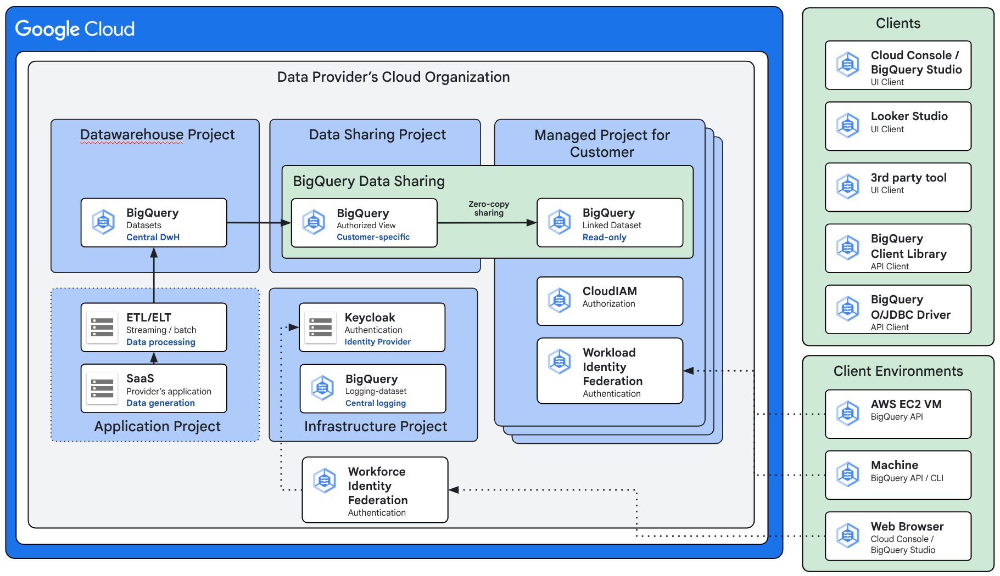

# Google Cloud Provider Managed BigQuery Projects Solution Accelerator

## 1. Overview

This solution accelerator provides automation (Terraform, scripts) to deploy an end-to-end "Provider Managed BigQuery Projects" (PMBQP) solution on Google Cloud. It is designed for Independent Software Vendors (ISVs) and Data Providers who want to share their BigQuery data with customers by provisioning and managing dedicated Google Cloud projects for each customer.

This setup allows customers to access and analyze shared data using BigQuery, even if they don't have their own Google Cloud environment. The provider manages the identity, access, data sharing, and cost controls for these customer-specific projects.

**Key Features & Architecture:**

* **Provider-Managed Identities:** Utilizes a self-hosted Keycloak instance (deployed on GKE) as the Identity Provider (IdP).
* **Federated Access:** Integrates Keycloak with Google Cloud's Workforce Identity Federation (WIF) to allow customer users to access GCP resources (like BigQuery Studio) using their Keycloak credentials without needing individual Google accounts.
* **Data Sharing:** Leverages BigQuery authorized views and Analytics Hub listings to securely share specific datasets with customer projects.
* **Isolated Customer Projects:** Provisions a dedicated Google Cloud project for each customer, linked to the provider's billing but with specific quotas and access controls.
* **Automation:** Uses Terraform for infrastructure provisioning and shell scripts for Keycloak deployment and configuration.

## 2. Solution Architecture



The solution involves several key components within the provider's Google Cloud organization:

* **Seed Project:** A foundational project to host the Terraform state bucket and potentially management service accounts.
* **Provider Core Projects:**
    * **IDP Project:** Hosts the GKE cluster for Keycloak and related networking (VPC, Load Balancer, Cloud SQL for Keycloak).
    * **Data Project:** Hosts the provider's source BigQuery datasets and Analytics Hub exchanges/listings.
    * Other projects for core services if needed.
* **Customer Managed Projects:** Individual projects created for each customer, containing linked datasets from Analytics Hub and specific IAM permissions for federated users.
* **Keycloak on GKE:** Acts as the central IdP.
* **Workforce Identity Federation:** Links Keycloak to GCP IAM, allowing federated user access.
* **Analytics Hub:** Used for sharing data via listings and linked datasets.
* **Cloud DNS:** Manages DNS records for the Keycloak public endpoint.

```
[YOUR_GCP_ORGANIZATION_ID]
│
├── Project: bqprovpr-[SUFFIX]-seed
└── Folder: bqprovpr-[SUFFIX]-root
  │
  ├── Folder: bqprovpr-[SUFFIX]-core
  │ │
  │ ├── Project: bqprovpr-[SUFFIX]-idp (Hosts the Identity Provider Keycloak)
  │ └── Project: bqprovpr-[SUFFIX]-logging (Host the BigQuery dataset for central audit logging)
  │
  ├── Folder: bqprovpr-[SUFFIX]-data
  │ └── Project: bqprovpr-[SUFFIX]-bqds (Hosts provider's source BQ datasets, AH Exchange/Listings)
  │
  └── Folder: bqprovpr-[SUFFIX]-cx (Hosts all customer projects)
    ├── bqprovpr-[SUFFIX]-cx-[CUSTOMER_KEY_1]
    ├── bqprovpr-[SUFFIX]-cx-[CUSTOMER_KEY_2]
    ├── ...
    └── bqprovpr-[SUFFIX]-cx-[CUSTOMER_KEY_N]
```

## 3. Prerequisites

Before you begin, ensure you have the following:

1.  **Google Cloud Organization:**
    * Access to a Google Cloud Organization.
    * Your user account needs high-level permissions for the initial setup (e.g., `Organization Administrator`, `Project Creator`, `Billing Account Administrator`, `Folder Creator`, `Organization Policy Administrator`, `Workforce Pool Admin`, `Service Account Admin`).
2.  **Billing Account(s):**
    * One primary Billing Account ID for the provider's projects (`BILLING_ACCOUNT_ID`).
    * Optionally, a separate Billing Account ID for customer projects (`CX_BILLING_ACCOUNT_ID`), or the same can be used.
3.  **Public Domain Name & Cloud DNS:**
    * A publicly registered domain name that you own and can manage.
    * A **Public Managed Zone** created in Google Cloud DNS for this domain, hosted in a GCP project you control. You will need its Zone Name.
    * The nameservers for your domain at the registrar must be updated to point to the Google Cloud DNS nameservers.
4.  **Local Tools:**
    * `gcloud` CLI (Google Cloud SDK) installed and authenticated.
    * `terraform` CLI (version ~1.x or as specified by the accelerator) installed.
    * `kubectl` installed.
    * `jq` (command-line JSON processor) installed.
    * Docker Desktop (or Docker engine) installed and running.

## 4. Solution stages overview

| Stage | High level overview | Manages infrastructure |
|---|---|---|
| Stage 0 (init) | Shell script: Creates and bootstraps the seed project that stores the Terraform state | Seed project<br/>State bucket<br/>API enablement on the seed project |
| Stage 0 (org setup) | Terraform: Configures the Cloud Organization | Configure Org Policies<br/>Domain Restricted sharing<br/>Allowed Workload Identity Pools |
| Stage 1 (bootstrap) | Terraform: Creates and configures the folders and projects | Provision folder structure<br/>Provision provider projects<br/>Configure IAM |
| Stage 2 (provider infra) | Terraform: Provisions the infrastructure required for the provider side | Provision VPC network and configure firewall<br/>Provision GKE cluster<br/>Provision CloudDNS zone<br/>Configure Private Google Access<br/>Provision LoadBalancer<br/>Provision CloudSQL database for Keycloak<br/>Provision Secret Manager secrets<br/>Configure log routing for centralized audit logging from client project’s folder<br/>Build and publish Keycloak (IdP) image |
| Stage 3 (identity provider) | Shell script: Deploys Keycloak and creates an administrative root account using a password saved to Cloud Secret Manager. | Deploy Keycloak to the Kubernetes cluster<br/>Wait for Keycloak to be healthy<br/>Configure root admin account and store access credentials locally for the terraform keycloak provisioner |
| Stage 4 (managed identities) | Terraform (Keycloak provisioner): Provisions the managed identities within Keycloak | Create the managed identities in Keycloak and store the generated passwords locally (for testing) |
| Stage 5 (identity federation) | Configures identity federation | Configure Workforce Identity Federation on the Organization level<br/>Configure Workload Identity Federation for AWS EC2 on the Project level. |
| Stage 6 (provider data sharing) | Provisions data sharing resources on the provider side. | Create customer-specific shared dataset within the provider’s data sharing project<br/>Create customer-specific authorized view within the dataset<br/>Create customer-specific BigQuery Listing within the provider’s data sharing project |
| Stage 7 (provider managed customer projects) | Provisions tenant project for each customer and configures them to be used by the provisioned identities | Create the provider managed projects in the customer projects folder<br/>Enable BigQuery APIs only<br/>Create the linked dataset by subscribing to the customer-specific listing<br/>Grant read-only permissions on BigQuery to the federated identities<br/>Workforce Identity Pool (External human users from Keycloak)<br/>Workload Identity Pool (EC2 instances from AWS) |

## 5. Setup Instructions

Follow these steps sequentially.

### Step 0: Environment Configuration

1.  **Configure `setup.env`:**
    * In the root of the `bq-ah-provider-projects` directory, copy `setup.env.example` to `setup.env`.
    * Edit `setup.env` and provide values for all **mandatory settings**:
        * `SUFFIX`: A short, unique string to append to resource names.
        * `PROV_ORG_ID`: Your Google Cloud Organization ID (numeric).
        * `PROV_ORG_NAME`: Your Google Cloud Organization name.
        * `BILLING_ACCOUNT_ID`: For provider projects.
        * `CX_BILLING_ACCOUNT_ID`: For customer projects (can be the same as above).
        * `GCLOUD_USER`: Your primary GCP user email.
        * `PROV_ADMIN_USER`: An admin user email for the provider org.
        * `DNS_ZONE_NAME`: The name of your Public Managed Zone in Cloud DNS.
        * `DNS_DOMAIN_NAME`: The **base domain name** you registered. Terraform will construct `keycloak.[DNS_DOMAIN_NAME]` for the IdP.


2.  **Configure `terraform.pmprojects.auto.tfvars`:**
    * In the root of the `bq-ah-provider-projects` directory, copy `common/terraform.pmprojects.auto.tfvars.example` to `terraform.pmprojects.auto.tfvars`.
    * Edit this file to define your sample customer projects. Ensure you add `customer_email`, `customer_first_name`, and `customer_last_name` attributes for each customer, using valid, existing Google Account emails for `external_identities` if you intend to use that feature for direct IAM bindings. For example:
        ```tfvars
        provider_managed_projects = {
          jane = {
            customer_name              = "jane"
            customer_id                = "CUS1496"
            provision_managed_identity = true
            provision_service_account  = true
            external_identities        = [ "test@xyz.com" ] # Valid Google Account
            customer_email             = "test@xyz.com"
            customer_first_name        = "TestJane"
            customer_last_name         = "User"
          }
          # ... other customers ...
        }
        ```

3.  **Create `generated/` and `temp/` Directories:**
    * In the root of the `bq-ah-provider-projects` directory, create these if they don't exist:
        ```bash
        mkdir generated
        mkdir temp
        ```

4.  **Run Initial Setup Scripts:**
    * From the root of `bq-ah-provider-projects`:
        ```bash
        ./s00-setup-google-cloud-seed.sh
        ```
      *(Purpose: Creates the seed project `bqprovpr-[SUFFIX]-seed`, links billing, enables initial APIs, creates the GCS Terraform state bucket `tf-state-bqprovpr-[SUFFIX]-seed`).*

    * Then run:
        ```bash
        ./s01-setup-generate-tf-configs.sh
        ```
      *(Purpose: Generates `generated/terraform.auto.tfvars` and `backend.tf` files for each Terraform stage based on `setup.env` and templates).*

### Step 1: Deploy Provider Infrastructure (Terraform)

This step creates the core provider organization structure, projects, and the infrastructure for the Keycloak Identity Provider.

**Execute Terraform Stages Sequentially:**

For each stage directory listed below:
1.  `cd [stage_directory]`
3.  `terraform init` (use `-reconfigure` if backend issues).
4.  `terraform plan` (review carefully).
5.  `terraform apply` (confirm with `yes`).

* **Stage `s00-provider-org-orgpolicies`:**
    * *Purpose:* Configures organization policies and organization-level IAM roles.

* **Stage `s01-provider-org-create-projects-bootstrap`:**
    * *Purpose:* Creates main provider projects (core, idp, data) and folders.

* **Stage `s02-provider-org-idp-infra`:**
    * *Purpose:* Deploys GKE, Cloud SQL, Load Balancer, DNS records, and certificates for Keycloak.

    * *Local Prereqs:* Docker running, `gcloud auth configure-docker [REGION]-docker.pkg.dev`.
    * *Potential Fixes:*

        * **GKE Authorized Networks:** Manually add your current public IP (e.g., `YOUR_IP/32`) to `allowlisted_external_ip_ranges_v4only` in `generated/terraform.auto.tfvars` before applying.

### Step 2: Deploy Identity Provider (Keycloak)

1.  Navigate to `s03-provider-org-deploy-keycloak`.
2.  Run the script: `./deploy-and-configure-keycloak.sh`
    * *Purpose:* Deploys Keycloak to GKE, waits for it to be live, and configures an initial client for Terraform.

### Step 3: Configure Federation & Data Sharing (Terraform)

* **Stage `s04-provider-keycloak-realms-users`:**
    * *Purpose:* Provisions Keycloak realms and users defined in `terraform.pmprojects.auto.tfvars`.

* **Stage `s05-provider-wlif-wfif`:**
    * *Purpose:* Configures Workforce Identity Federation (WIF) pools and providers in GCP, linking to Keycloak.

* **Stage `s06-provider-bq-ds-data-sharing`:**
    * *Purpose:* Creates provider source BigQuery datasets, loads sample data, creates Analytics Hub exchanges and per-customer listings.

### Step 4: Provision Customer Managed Projects (Terraform)

* **Stage `s10-consumer-projects`:**
    * *Purpose:* Creates individual GCP projects for each customer, links billing, enables APIs, sets IAM, and subscribes to Analytics Hub listings.

## 6. Testing the Solution

1.  **Retrieve Keycloak User Credentials:**
    * Username: The `customer_email` used in `terraform.pmprojects.auto.tfvars`.
    * Password: Run `terraform output user_password` in the `s04-provider-keycloak-realms-users` directory. If this doesn't work or is forgotten, reset the password via the Keycloak Admin Console.
2.  **Get Workforce Pool Sign-in URL:**
    * In GCP Console: IAM & Admin -> Workforce Identity Federation.
    * Select your **Organization**.
    * Click the pool name.
    * Go to the "Providers" tab, click the provider name.
    * Copy the "Sign-in URL".
3.  **Customer Login:**
    * Use an Incognito browser window and go to the Sign-in URL.
    * Log in via the Keycloak page with the customer's Keycloak credentials.
4.  **Access BigQuery:**
    * You should be redirected to the GCP Console as the federated user.
    * Select the customer's project.
    * Navigate to BigQuery Studio.
5.  **Query Data:**
    * Find the linked dataset.
    * Query a view/table within it:
        ```sql
        SELECT * FROM `[CUSTOMER_PROJECT_ID].[LINKED_DATASET_ID].[VIEW_OR_TABLE_NAME]` LIMIT 10;
        ```
    * If data is returned, the end-to-end flow is working.

## 7. Cleanup

To remove the resources created by this POC:

1.  Run `terraform destroy` in **each stage directory, in reverse order of creation** (`s10`, then `s06`, `s05`, `s04`, `s02`, `s01`, `s00`).
2.  After all Terraform resources are destroyed, run the cleanup script `./s99-cleanup.sh` to delete the seed project and state bucket. If not, manually delete:
    * The GCS state bucket (`tf-state-bqprovpr-[SUFFIX]-seed`).
    * The seed project (`bqprovpr-[SUFFIX]-seed`).
3.  Remove the Google Cloud nameservers from your domain registrar.

## 8. Versioning

Initial Version August 2024

## 9. Code of Conduct

[View](../docs/code-of-conduct.md)

## 10. Contributing

[View](../docs/contributing.md)

## 11. License

[View](../LICENSE)

## 12. Disclaimer

This project is not an official Google project. It is not supported by Google and Google specifically disclaims all warranties as to its quality, merchantability, or fitness for a particular purpose.
