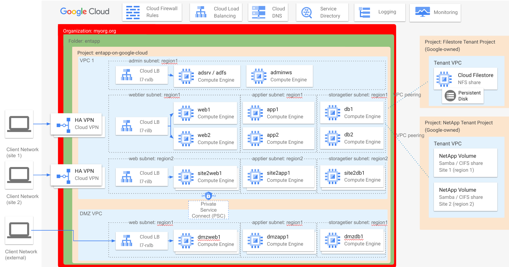

# Enterprise Business Applications on Google Cloud IaaS Deployment

## Overview

This repository will create the common Infrastructure-as-a-service (IaaS) setup for the typical reference architectures of enterprise business applications.

Key objectives:
- Configure networking
- Deploy Active Directory Domain Controller
- Deploy NetApp Volume integrated with Active Directory
- Deploy CloudSQL for SQL Server
- Use Managed Private CA to provision X509 Machine Certificates
- Provision VMs for the different tiers (Client, Web, Application, Storage)
- Provision Internal and External Load Balancers
- Configure Private Service Connect between the two VPCs
- Configure DNS using CloudDNS

## Architecture diagram



## Usage

1. Have an "empty" Google Cloud project ready with Owner rights on it

2. Create a secret called `secret-adpwd` and set it to a password used for the AD Administrator account
   `echo -n "<secret password>" |  gcloud secrets create secret-adpwd --project my-project-id --data-file=-`

3. Create a secret called `secret-register-computer` and set it to a password used for the Domain Joiner account
   `echo -n "<secret password>" |  gcloud secrets create secret-register-computer --project my-project-id --data-file=-`

4. Create a secret called `secret-database` and set it to a password used for the managed database (CloudSQL SQL Server)
   `echo -n "<secret password>" |  gcloud secrets create secret-database --project my-project-id --data-file=-`

5. Create GCS bucket for storing the Terraform state

6. Create `backend.tf` in each stage (see `backend.tf.example`)

   1. `stage0-bootstrap`
   2. `stage1-admin-vms-adc`
   3. `stage2-storage-netapp-csql`
   4. `stage3-multi-tier-iaas`

7. Update `terraform.auto.tfvars` and `terraform_iaas.auto.tfvars`

   1. In `terraform.auto.tfvars` it `dns_ad_domain` must match the AD domain name on the Windows AD Controller

8. Upload the (potentially Let'S Encrypt) certificates to `secrets/`

   1. `lb_cert.pem`
   2. `lb_chain.pem`
   3. `lb_fullchain.pem`
   4. `lb_privkey.pem`

9. `tf init && tf apply` in each stage, respecting stage sequence (see the following section for details)

### Stage 0: bootstrap (`stage0-bootstrap`)

Prerequisites:
- `secret-adpwd` and `secret-register-computer` created

This stage configures the following aspects:
- Enables the required Google APIs
- Configures networking
  - VPCs
  - Subnets
  - Network Address Translation
  - Private Service Access (for CloudSQL and NetApp)
  - Private Google Access
  - Cloud DNS private zones
  - Service Accounts
  - Secrets

### Stage 1: Admin VMs + Active Directory Controller (ADC) (`stage1-admin-vms-adc`)

Prerequisites:
- `stage0-bootstrap` deployed
- `secret-adpwd` and `secret-register-computer` created
- The docker image for the register-compute CloudRun service is published to a Docker repository (e.g. Google Cloud Artifact Registry)

   See https://github.com/GoogleCloudPlatform/gce-automated-ad-join/tree/master/ad-joining for details

   Set the image path in Terraform variables

This stage configures the following aspects:
- Provision and configure ADC through startup scripts
- Create CloudDNS private zone to forward DNS queries of the AD domain to ADC
- Publish a Cloud Run service to implement automatic AD joining of the VMs

Manual steps after Terraform run:
- Remember the output `regfunc_url` from Terraform
- Check Serial Port 1 of `adsrv` and verify that the AD Forest has been created
- Log in to the `adsrv` VM and create the register-computer account required for automatic joining of new VMs (see `scripts/dc-init-AD-for-autojoin.ps1`)
- Log in to the `adminws` VM and test automatic joining by downloading the join script from `regfunc_url` and executing it from an Administrative PowerShell session

   ```
   PS C:\Users\predy> .\join.ps1
   AD Join diagnostics: Not enabled
   AD site-awareness: Using site 'Default-First-Site-Name' for join
   Successfully registered computer account.


   ComputerName         : adminws
   ComputerPassword     : *
   Domain               : entapp.mydomain.tld
   DomainController     : addom.entapp.mydomain.tld
   OrgUnitPath          : OU=my-project-id,OU=Projects,DC=entapp,DC=mydomain,DC=tld
   OriginalComputerName : adminws
   ```
- Log in to the `adsrv` VM and install Active Directory Federation Services (ADFS)

### Stage 2: NetApp (`stage2-storage-netapp-csql`)

Prerequisites:
- `stage1-admin-vms-adc` executed
- Active Directory confirmed working

This stage configures the following aspects:
- Create ActiveDirectory policy for NetApp storage pools
- Create NetApp storage pools with CIFS/Samba
- Create NetApp volumes with CIFS/Samba
- Create CloudSQL database

### Stage 3: multi-tier IaaS (`stage3-multi-tier-iaas`)

Prerequisites:
- `stage2-storage-netapp-csql` executed
- Active Directory confirmed working

This stage configures the following aspects:
- Create VMs in each Tier (Client / Web / Application / Storage)
- Create Regional Internal Application Load Balancer for Web Tier
- Create Regional External Application Load Balancer for Web Tier
- Create Global External Application Load Balancer for Web Tier
- Create Private Service Connect link between the main VPC and the dmz VPC

## Versioning

Initial Version Aug 2022
Revised Version Feb 2025

## Code of Conduct

[View](./docs/code-of-conduct.md)

## Contributing

[View](./docs/contributing.md)

## License

[View](./LICENSE)

## Disclaimer

This project is not an official Google project. It is not supported by
Google and Google specifically disclaims all warranties as to its quality,
merchantability, or fitness for a particular purpose.
